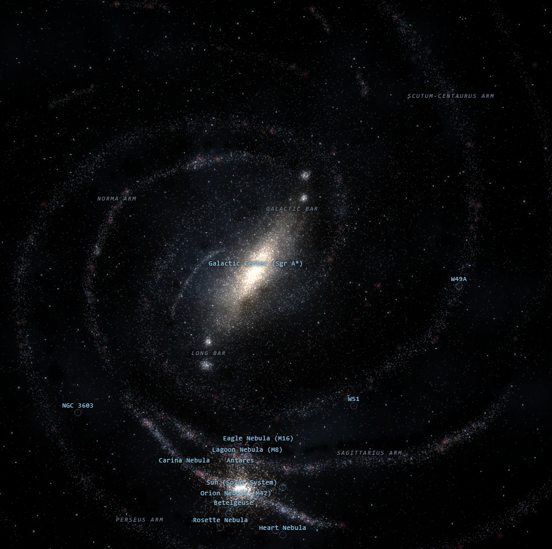

# Galaxy Map

An interactive, explorable 3D map of the Milky Way in a single HTML file. Procedurally generated stars over an arm skeleton digitized from the NASA/JPL-Caltech reference map, blended with real astronomical data — actual Gaia stars, measured maser parallaxes, and famous deep-sky objects at their true positions.

   

---

---

## What it is

Open `galaxy-map.html` in any modern browser. No build step, no server, no install — the only external dependency is Three.js from a CDN.

- **~130,000 procedural stars** (up to 1,000,000 via slider) on a spiral-arm skeleton traced from the NASA/JPL-Caltech annotated Milky Way map — arm positions, junctions, breaks, and fragments match the reference
- **~57,500 real stars** from Gaia DR3 around the Sun, plus the 50 brightest naked-eye stars (Sirius, Alpha Centauri, Canopus…) from Hipparcos data, which Gaia's detectors can't observe
- **199 measured maser parallaxes** (Reid et al. 2019) — the actual VLBI data points behind modern spiral-arm models, color-coded by arm (toggle)
- **Real deep-sky objects at true positions**: 16 H II regions (Orion, Carina, Eagle…), supernova remnants (Crab, Vela, Cas A…), open clusters (Pleiades, Double Cluster…), globular clusters floating in the halo (Omega Centauri, 47 Tucanae…), planetary nebulae, the Coalsack, and the Magellanic Clouds
- **Dust lanes and H II knots extracted from the reference image itself** — the painting's own texture at its own coordinates
- Clickable/searchable landmarks, free-fly and orbit camera, heliocentric distance-grid overlay, photo mode, and a ~60-slider dev tuning panel

## Controls

| Input | Action |
|-------|--------|
| Left-drag | Orbit the galaxy |
| Scroll / pinch | Zoom |
| Right-drag | Pan |
| Click star | Details in the side panel |
| Search + Enter | Fly to a named landmark |
| Free-fly | WASD + mouse-look flight (Q/E down/up, Shift boost, Esc exit) |
| P | Photo mode — hides UI, saves a PNG |
| Toggles | Labels, markers, gas & dust, Gaia stars, distance grid, maser layer, bloom, rotation |

## Data & credits

- **Reference image**: NASA/JPL-Caltech/R. Hurt (SSC), annotated Milky Way map — the ground truth for arm geometry and the visual target
- **Gaia DR3** (ESA) — solar-neighborhood star positions, colors, magnitudes
- **Reid et al. 2019**, ApJ 885, 131 — maser parallaxes and spiral-arm fits
- **HYG Database** (D. Nash) — bright-star supplement
- Deep-sky object coordinates and distances from standard literature values

The `tools/` directory contains the extraction and verification pipeline used to digitize the arm skeleton from the reference image (image processing, transform calibration, geometry checks, and a Node stub-DOM test harness).

## License

MIT — see [LICENSE](LICENSE).
